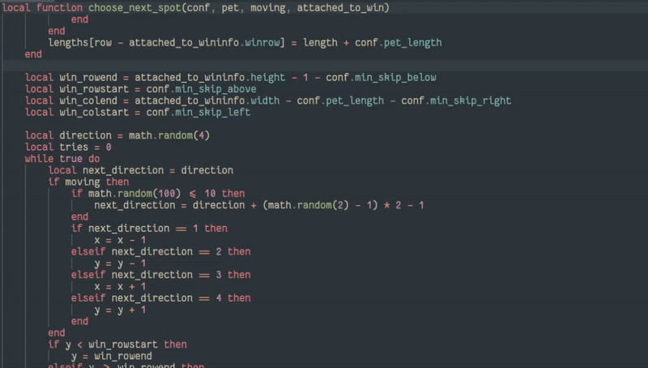

# pet.nvim

Bring a *pet party* to your mundane text editing - release the pets to **waddle** across your editor!



- [Features](#features)
- [Installation](#installation)
- [Quick Start](#quick-start)
- [API](#api)
- [Options](#options)
- [Inspiration](#inspiration)

## Features

- playful pets *wander* across your screen
- pick *your own pet*
- your well-mannered companions *respect* your workspace, keeping their *paws off your text* (and line numbers, status lines etc)
- your friends *follow you* across the *windows*, and will start appearing wherever currently you are

## Installation

<details>
  <summary>lazy.nvim</summary>

Add the following to your `lazy.nvim` config:

```lua
{
    "rhusiev/pet.nvim",
    config = function()
        require("pet").start_pet_party() -- To start the party when you open Neovim
    end,
}
```

</details>

<details>
  <summary>packer.nvim</summary>

Add the following to your `packer.nvim` config:

```lua
use {
    "rhusiev/pet.nvim",
    config = function()
        require("pet").start_pet_party() -- To start the party when you open Neovim
    end,
}
```

</details>

<details>
  <summary>vim-plug</summary>

Add the following to your `vim-plug` config:

```vim
Plug 'rhusiev/pet.nvim'
```

</details>

## Quick Start

Run `:PetStartParty` to start the party!

To stop the party - `:PetStopParty`, to add just one pet - `:PetAdd`.

## API

There is a lua API to handle the party with more control:

```lua
require("pet").start_pet_party() -- Start the party
require("pet").stop_pet_party() -- Stop the party
require("pet").add_pet() -- Add a single pet
```

## Options

You can add configuration when starting a party or adding a pet. Here are the default values of the config:

```lua
require("pet").start_pet_party({
    -- The maximum number of pets simultaneously in the party
    max_pets = 4,
    -- The period in milliseconds at which a pet is spawned
    -- (if there still is some room in the party)
    spawn_period = 2000,
    -- The period in milliseconds at which a pet will move
    step_period = 150,
    -- The time in milliseconds before the first pet appears
    wait_period = 1000,
    -- The string to use as a pet
    pet_string = "🐧",
    -- The number of moves a pet does before disappearing
    repeats = 100,

    -- The minimum number of spaces at the window edges,
    -- around which a pet can not move
    min_skip_left = 0,
    min_skip_right = 0,
    min_skip_above = 0,
    min_skip_below = 0,
})
```

## Inspiration

The original idea comes from [duck.nvim](https://github.com/tamton-aquib/duck.nvim)

I wanted to change the behavior completely, so I decided to write my own plugin.
