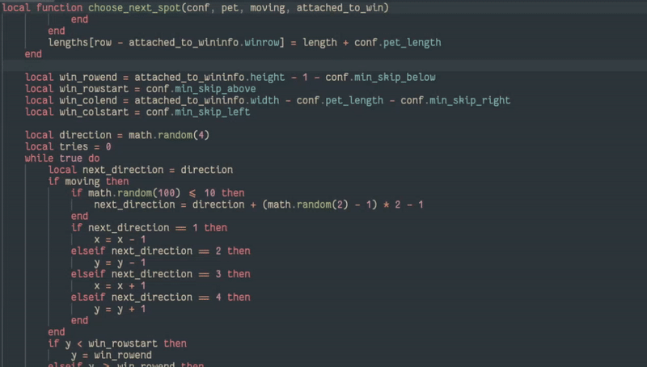

# pet.nvim

Bring a *pet party* to your mundane text editing - release the pets to **waddle** across your editor!



- [Features](#features)
- [Installation](#installation)
- [Quick Start](#quick-start)
- [Options](#options)
- [Move function](#move-function)
- [API](#api)
- [Inspiration](#inspiration)

## Features

- playful pets *wander* across your screen
- pick *your own pet*
- your well-mannered companions *respect* your workspace, keeping their *paws off your text* (and line numbers, status lines etc)
- your friends *follow you* across the *windows*, and will start appearing wherever currently you are
- **built-in flocking behavior** for dynamic, group-based movement

## Installation

<details>
  <summary>lazy.nvim</summary>

Add the following to your `lazy.nvim` config:

```lua
{
    "rhusiev/pet.nvim",
    config = function()
        require("pet").start_pet_party() -- To start the party when you open Neovim
    end,
}
```

</details>

<details>
  <summary>packer.nvim</summary>

Add the following to your `packer.nvim` config:

```lua
use {
    "rhusiev/pet.nvim",
    config = function()
        require("pet").start_pet_party() -- To start the party when you open Neovim
    end,
}
```

</details>

<details>
  <summary>vim-plug</summary>

Add the following to your `vim-plug` config:

```vim
Plug 'rhusiev/pet.nvim'
```

</details>

## Quick Start

Run `:PetStartParty` to start the party!

To stop the party - `:PetStopParty`, to add just one pet - `:PetAdd`.

You can also use the lua API: `require("pet").start_pet_party(config)`, `require("pet").stop_pet_party()`, `require("pet").add_pet(config)`

**Note:** All configuration parameters are completely optional! If you just want to quickly change your pet to a cat, you can simply pass a minimal config:
```lua
require("pet").start_pet_party({ pet_string = "🐈" })
```

## Options

You can add configuration when starting a party or adding a pet. *All parameters are optional*, so you only need to define the ones you wish to override. Here are the default values:

```lua
require("pet").start_pet_party({
    -- The maximum number of pets simultaneously in the party
    max_pets = 4,

    -- The period in milliseconds at which a pet is spawned
    -- (if there still is some room in the party)
    spawn_period = 2000,
    -- The period in milliseconds at which a pet will move
    step_period = 150,
    -- The time in milliseconds before the first pet appears
    wait_period = 1000,

    -- The string to use as a pet
    pet_string = "🐧",
    -- How many characters does a string visually occupy
    -- If not present, defaults to the length lua provides, which is the length in bytes, so is not always accurate
    pet_length = #"🐧",

    -- The number of moves a pet does before disappearing
    repeats = 100,

    -- The minimum number of spaces at the window edges,
    -- around which a pet can not move
    min_skip_left = 0,
    min_skip_right = 0,
    min_skip_above = 0,
    min_skip_below = 0,

    moving_opts = {
        -- With what probability the pet will stop at each step
        stop_moving_probability = 5,
        -- With what probability the pet will start moving again after the stop
        start_moving_probability = 13,
    },

    -- Whether to avoid moving over text
    avoid_text = true,
    -- A function that takes a pet, its coordinates, and all active pets, outputting new coordinates.
    moving_function = require("pet.defaults").moving_function,
})
```

You can also find all the default values at `lua/pet/defaults.lua`.

The same config can be passed to `require("pet").add_pet()`, except for `max_pets` and `spawn_period`, which will be ignored.

## Move function

The default `moving_function` moves in the same direction as previously and with some probability changes its direction. Additionally, with some probability, a pet might stop moving.

### Flocking Behavior
The plugin comes with a built-in flocking behavior! To make your pets flock together instead of wandering aimlessly, override the `moving_function` and `moving_opts` (`moving_opts` are also optional):

```lua
require("pet").start_pet_party({
    moving_function = require("pet.defaults").flocking_function,
    moving_opts = {
        separation_radius = 5,
        alignment_radius = 6,
        separation_weight = 7.5,
        cohesion_weight = 0.02,
        alignment_weight = 1.2,
        noise = 0.1,
        max_speed = 2.0,
        drag = 0.75,
    }
})
```

### Your own move function

You can write your own function. It should take a `pet` as the first argument, `x` as the second, `y` as the third, and `all_pets` (a table of all currently active pets) as the fourth. Note that **`x` and `y` are global coordinates relative to the whole editor**. 

You can use `pet.state` as a table with a state that will be preserved until the next invocation of the function. However, as there is no state during the first invocation, a recommended practice is to check `if pet.state == nil` at the beginning of the function to initialize it. For example, the default implementation uses:

```lua
if pet.state == nil then
    pet.state = {
        moving = true,
        direction = math.random(4),
    }
end
```

Because your custom move function has access to `all_pets` and the Neovim API, the possibilities are endless! You could easily program a predator-prey dynamic where a `🐈` hunts a `🐁` based on coordinates from the `all_pets` table, or use `vim.api.nvim_win_get_cursor(0)` to make the pets chase your typing cursor.

There are also helper functions to translate between relative (to the window) and absolute (relative to the whole editor) coordinates. You can find them at `lua/pet/utils.lua` or at the [API](#API) section.

## API

There is a lua API to handle the party with more control:

```lua
require("pet").start_pet_party(config) -- Start the party
require("pet").stop_pet_party()        -- Stop the party
require("pet").add_pet(config)         -- Add a single pet
```

Some useful helper functions to build customization around the plugin:

```lua
local pet_utils = require("pet.utils")

-- Convert x relative to a window to absolute (relative to the whole editor)
pet_utils.to_absolute_x(x, attached_to_wininfo)
-- Convert x absolute (relative to the whole editor) to relative to a window
pet_utils.to_relative_x(x, attached_to_wininfo)
-- Convert y relative to a window to absolute (relative to the whole editor)
pet_utils.to_absolute_y(y, attached_to_wininfo)
-- Convert y absolute (relative to the whole editor) to relative to a window
pet_utils.to_relative_y(y, attached_to_wininfo)
-- Convert x and y relative to a window to absolute (relative to the whole editor)
pet_utils.to_absolute(x, y, attached_to_wininfo)
-- Convert x and y absolute (relative to the whole editor) to relative to a window
pet_utils.to_relative(x, y, attached_to_wininfo)
-- Draw a character at x,y position for a certain amount of time
pet_utils.draw_mark(x, y, char, time, attached_to_wininfo)
```

For documentation, see [utils.lua](lua/pet/utils.lua)

## Inspiration

The original idea comes from [duck.nvim](https://github.com/tamton-aquib/duck.nvim)

I wanted to change the behavior completely, so I decided to write my own plugin.
